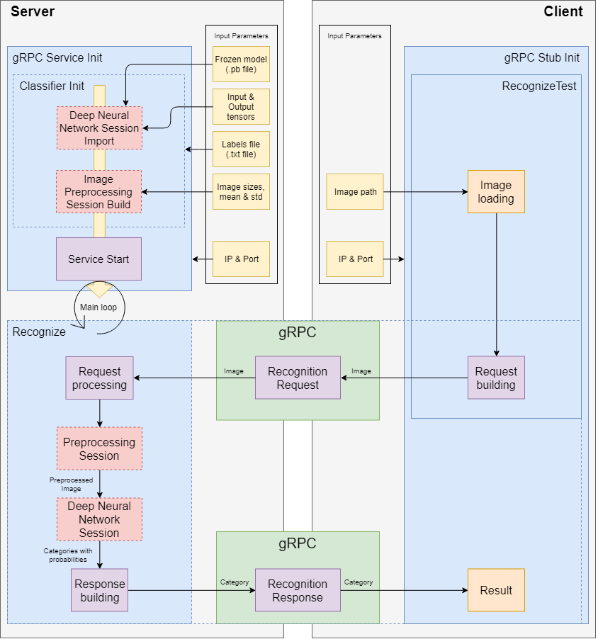

# Tensorflow recognition server & client written in Python & gRPC

## Installing

Everything is already configured in settings.yml file.
You just need to install all python packages using
 
```bash
pip install -r requirements.txt
```

and change IP & PORT in settings.yml.

## Project pipeine

<center>



</center>

### Description

* **Service Initialization**
    1. All default parameters are parsed from **settings.yml** file, but they could be redefined by user through **FLAGS**. Some of them (flags under #FIXED position) should not be redefined, because they have fixed value (e.g. image width & height, mean & std, etc.).
    2. First of all performs Classifier initialization which consist of 2 main stages: **DNN Session Import** from .pb file and **Image preprocessing Session Build** (it is used to decrease memory usage and speed up the inference of recognition).
    3. Then starts gRPC Service which is listening for request.

* **Recognition test**
    1. Everything starts from client. Image is loaded from path provided by the user or from settings.yml file default path.
    2. Loaded image is divided by chunks to build the request.
    3. Request sends to provided IP & port of server.
    4. Image goes to preprocessing session on the server to change size and subtract mean and divide by standard deviation.
    5. Preprocessed image goes to DNN Session to receive output probabilities.
    6. Having categories we can build response and send it to the client.
    7. Client prints the results.
    
* Everything that is in dotted line is logged with time hooks.
    
### Project structure

Let's go through the project structure.
* **images** - folder of images which could be used for testing of algorithm.
* **classes**
    * **classifier.py** - file which contains class that wraps Tensorflow frozen DNN usage.
    * **logger.py** - file which contains Logger class for printing and writing logs to file.
* **service** - files used for gRPC framework
    * **service.proto** - file which describes structure of your protocol buffer data.
    * **service_pb2.py & service_pb2_grpc.py** - generated files
* **tmp**
    * **\*.pb** - files that contain already trained DNN structure with reduced size to improve performance.
    * **labels.txt** - file which contains all recognition labels.
* **Makefile** - bash script used for generation gRPC classes from .proto file.
* **client.py** - file which runs the gRPC client.
* **inference.py**  - file which used only for algorithm of DNN recognition inference. Some kind of test for recognition engine.
* **server.py** - file which runs the gRPC server.
* **settings.yml** - file contains all settings used for this project. You don't need to configure anything, except environment (python, pip packages).
* **requirements.txt** - file with package requirements.
Files that are not mentioned are redundant.

## Server start on GPU
```
CUDA_VISIBLE_DEVICES=0 python server.py
```

## Server start on CPU
```
CUDA_VISIBLE_DEVICES= python server.py
```

## Client start
```
python client.py
```

# Known issues

* Slow first recognition due to memory allocation and maybe other reasons. (Could be solved just by performing 1 recognition just after initialization)

## Requirements

* Python 3
* PIP packages:
    * Tensorflow
    * gRPC IO
    * gRPC IO Tools
    * Yaml
    * sqlite3

### Built With

* [Python](https://www.python.org/) - The language used.
* [Tensorflow](https://www.tensorflow.org/) - The library used.
* [GRPC](https://grpc.io/) - The library used.

### Author

* [smivv](https://github.com/smivv) - Vladimir Smirnov.

### License

This project is licensed under the MIT License - see the [LICENSE.md](LICENSE.md) file for details